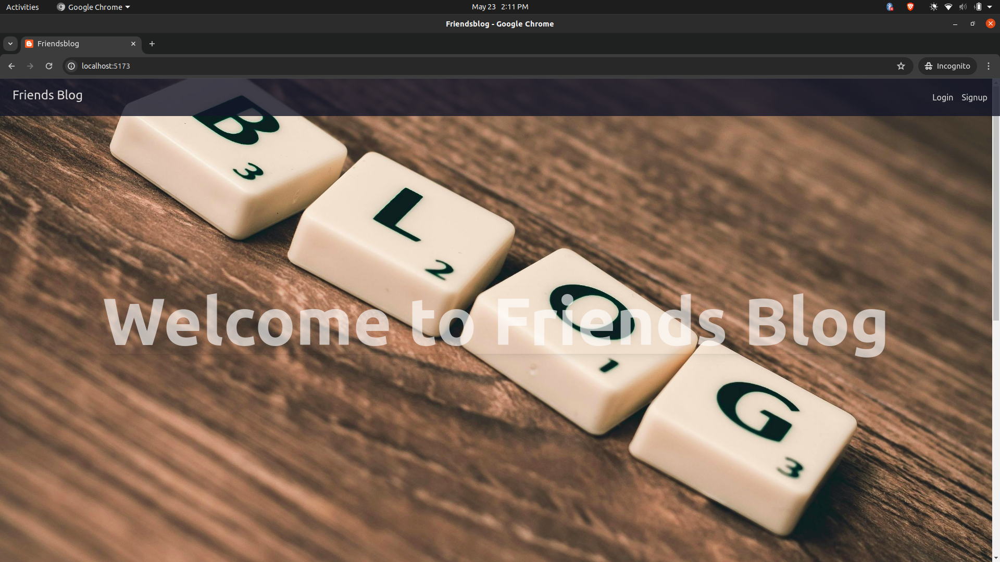
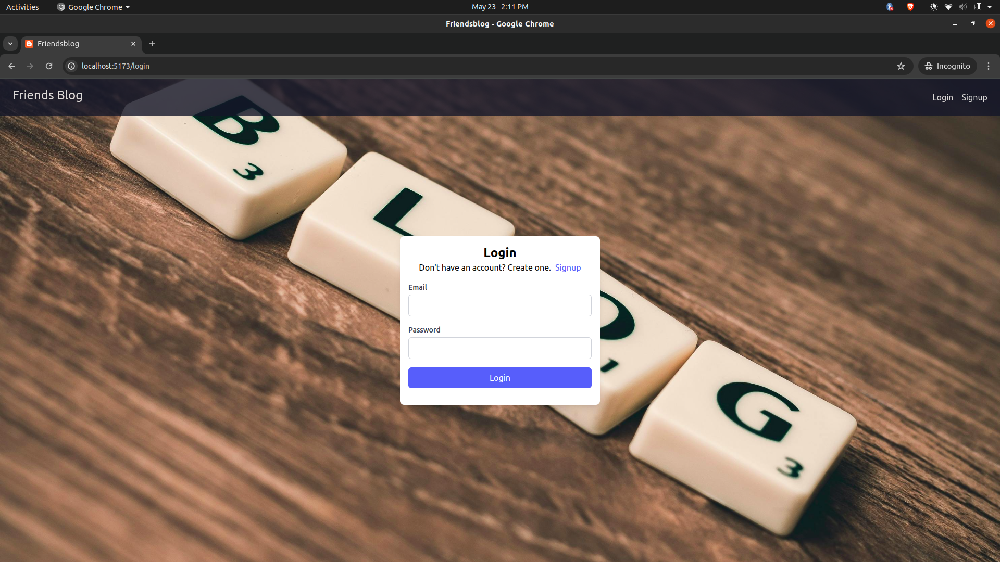
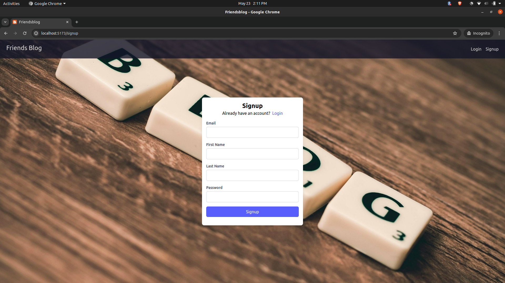

# Friends Blogging WebApp

This webapp is like a diary where you can write your daily activities and share them with your friends. You can create private groups and share your blogs with them. You can also comment on each others blogs and like them. You can also follow your friends and see their blogs in your feed.

# demo

[comming soon](#)

# Features

The docs folder contains requirements and design documents, stack used, and the ER diagram of the database.

# screenshots of the webapp

1. Home Page

2. Login Page

3. Signup Page 

